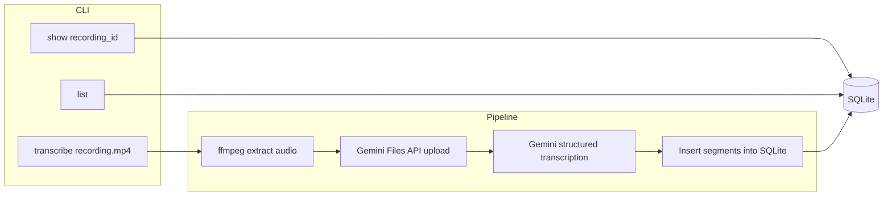

# Call Transcription CLI Demo

## Recommendation

Use **Python + SQLite + Gemini multimodal audio** with **ffmpeg** for audio extraction. This is the fastest path to a credible tech-assessment demo: one language, zero infra, strong Arabic/English code-switching via Gemini, and a clear CLI story evaluators can run in minutes.

| Choice | Why |
|--------|-----|
| Python | Best ecosystem for CLI + ffmpeg + SQLite; official `google-genai` SDK |
| SQLite | Zero setup; file-based DB is fine for a demo; easy to inspect with `sqlite3` |
| Gemini (not Cloud Speech-to-Text) | You already have the API key; native code-switching; structured JSON segments with timestamps in one call |
| ffmpeg | Call recordings with screen share are usually `.mp4`/`.webm`; you only need the audio track |

Avoid building a web UI, Postgres, or real-time Live API unless the assessment explicitly asks for them.

---

## Architecture



**Flow:**
1. User runs `transcribe <path>` on an audio or video file.
2. If video, ffmpeg extracts mono 16 kHz WAV (Gemini downsamples anyway; consistent input helps).
3. Audio is uploaded via Gemini Files API (handles long calls; inline is fine for short clips under ~20 MB).
4. Gemini returns **structured JSON**: segments with `start_ms`, `end_ms`, `text`, optional `speaker`, `language`.
5. Rows are saved to SQLite; CLI prints recording ID and a short preview.

---

## Project layout

```
transcriber/
├── README.md              # setup, env, example commands
├── requirements.txt       # google-genai, python-dotenv, typer[all]
├── .env.example           # GEMINI_API_KEY=
├── transcriber/
│   ├── __init__.py
│   ├── cli.py             # Typer commands: transcribe, list, show
│   ├── audio.py           # ffmpeg extract + validate formats
│   ├── gemini_client.py   # upload + transcribe with response schema
│   ├── db.py              # schema, migrations, CRUD
│   └── models.py          # dataclasses / pydantic for segments
└── data/
    └── transcriber.db     # gitignored
```

Keep it flat — no Celery, no Docker requirement unless evaluators expect it.

---

## Database schema

**`recordings`**
- `id` (UUID or integer PK)
- `source_path`, `filename`
- `duration_ms` (optional, from ffprobe)
- `status` (`pending` | `processing` | `done` | `failed`)
- `error_message` (nullable)
- `summary` (nullable — optional one-line Gemini summary)
- `created_at`

**`segments`**
- `id`
- `recording_id` (FK)
- `start_ms`, `end_ms` (integers)
- `text` (verbatim transcript; preserve Arabic script + English)
- `language` (`ar` | `en` | `mixed` — from model or heuristic)
- `speaker` (nullable, e.g. `Speaker 1`)
- `segment_index` (ordering)

Indexes on `recording_id` and `(recording_id, start_ms)`.

---

## Gemini transcription strategy

**Model:** `gemini-2.5-flash` (or latest stable flash model available on your key — fast, cheap, good for assessments).

**Prompt essentials** (mixed Arabic/English):
- Transcribe **verbatim**; do not translate Arabic to English.
- Preserve code-switching within segments when speakers mix languages mid-sentence.
- Output **segment-level timestamps** in milliseconds.
- Optionally identify speakers if discernible.
- Tag each segment’s dominant language.

**Structured output** (JSON schema via Gemini `response_schema`):

```json
{
  "summary": "Brief call summary in English",
  "segments": [
    {
      "start_ms": 0,
      "end_ms": 4200,
      "speaker": "Speaker 1",
      "language": "mixed",
      "text": "Hello, كيف حالك today?"
    }
  ]
}
```

Use the [Gemini audio understanding docs](https://ai.google.dev/gemini-api/docs/audio) pattern: upload file → `generate_content` with audio part + schema. Retry once on transient API errors.

**Why not Live API:** Live Translate is for real-time streaming; your scope is **file-based post-call transcription**.

---

## CLI commands

| Command | Behavior |
|---------|----------|
| `transcribe <file>` | Full pipeline; prints `recording_id` and first few segments |
| `list` | Table of recordings (id, filename, status, segment count, created) |
| `show <id>` | Full transcript with `[MM:SS.mm]` timestamps; `--json` for raw export |
| `show <id> --from 120 --to 300` | Optional time-range filter (nice polish, low effort) |

Use **Typer** for help text and exit codes (`1` on failure).

---

## Audio / video handling

- **Supported input:** `.mp3`, `.wav`, `.m4a`, `.mp4`, `.webm`, `.mov` (anything ffmpeg reads).
- **Screen share:** ignored at video level; only audio track is extracted.
- **Dependency:** require `ffmpeg` on PATH; CLI checks at startup with a clear error if missing.
- **Temp files:** extract to system temp dir; delete after successful transcription.

---

## What will impress evaluators (without over-building)

1. **README** with: prerequisites (`python 3.11+`, `ffmpeg`), `pip install`, `.env` setup, sample run, sample output screenshot or text block.
2. **Status tracking** in DB (`processing` → `done` / `failed`) so partial failures are visible.
3. **Structured logging** to stderr; human-readable summary to stdout.
4. **Small unit test** for DB insert/parse logic (mock Gemini response JSON) — optional but strong signal.
5. **`.gitignore`** for `.env`, `data/`, temp audio, sample recordings.

Skip for v1: auth, Postgres, web UI, speaker enrollment, word-level timestamps.

---

## Environment and secrets

```bash
# .env
GEMINI_API_KEY=your_key_here
DATABASE_PATH=./data/transcriber.db   # optional override
GEMINI_MODEL=gemini-2.5-flash         # optional override
```

Never commit the API key. Document that evaluators use their own key or a shared test key.

---

## Risks and mitigations

| Risk | Mitigation |
|------|------------|
| Gemini timestamp drift on long files | Segment-level timestamps are usually good enough for demo; chunk files >30 min if needed |
| Video has no audio track | Fail fast after ffprobe with clear message |
| Arabic diacritics / dialect variance | Prompt: verbatim transcription, Modern Standard + dialect OK |
| Large file upload limits | Files API + poll until `ACTIVE`; fall back to chunked transcription for very long calls |
| Assessment runs offline | Document that Gemini API requires network; provide a `--dry-run` that only extracts audio (optional) |

---

## Implementation order

1. Scaffold project, `requirements.txt`, `.env.example`, README skeleton.
2. SQLite schema + `db.py` (create tables, insert recording/segments, query).
3. `audio.py` — ffprobe duration, ffmpeg extract.
4. `gemini_client.py` — upload, transcribe with schema, parse response.
5. `cli.py` — wire `transcribe`, `list`, `show`.
6. End-to-end test with a short mixed Arabic/English sample (you provide the file).
7. Polish README and error messages.

**Estimated effort:** 4–6 hours for a clean, review-ready demo.

---

## Sample evaluator experience

```bash
python -m venv .venv && source .venv/bin/activate
pip install -r requirements.txt
cp .env.example .env   # add GEMINI_API_KEY
brew install ffmpeg    # or apt install ffmpeg

python -m transcriber.cli transcribe samples/call_with_screenshare.mp4
# => Recording abc123 saved (42 segments)

python -m transcriber.cli show abc123
# =>
# [00:00.00 - 00:04.20] Speaker 1 (mixed): Hello, كيف حالك today?
# ...
```

This directly maps to the assessment scope: **call recording in → timestamped transcript in DB**.
